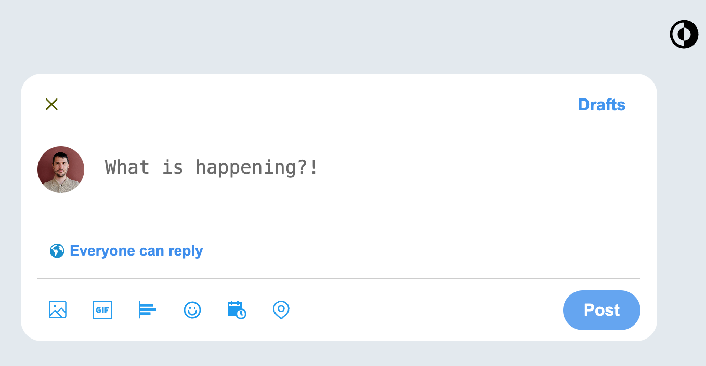

# No-Feed Twitter



## Overview

No-Feed Twitter is a Flask-based web application that mimics the image upload and tweet posting feature of Twitter. It allows users to upload images, view a dynamic preview grid, and post messages along with images in a Twitter-like fashion without the distraction of a feed.

## Key Features

- Image upload with preview functionality.
- Dynamic grid layout for image previews.
- Ability to delete images from the preview.
- Tweet posting with image attachments.
- Configurable through `config.py` for API keys and other settings.

## Getting Started

### Prerequisites

Before running this project, you will need to have Python and Flask installed on your system. You will also need to set Twitter / X API keys.

### Installation

Clone the GitHub repository to your local machine:

```bash
git clone https://github.com/Tizzz-555/no-feed-twitter.git
cd your-repository-name
```

Create a virtual environment and activate it:

```bash
python -m venv env
source env/bin/activate  # On Windows use `env\Scripts\activate`
```

Install the required dependencies:

```bash
pip install -r requirements.txt
```

Create a config.py file in the root directory of the project and enter your API keys and other configuration settings:

```python
CONSUMER_KEY = "your_consumer_key"
CONSUMER_SECRET = "your_consumer_secret"
ACCESS_TOKEN = "your_access_token"
ACCESS_TOKEN_SECRET = "your_access_token_secret"
```

Running the Application
Start the Flask application by running:

```bash
flask run
```

Or directly with python:

```bash
python app.py
```

The application will be accessible at http://localhost:5000 or the port specified by Flask.

## Usage

Navigate to the home page and use the interface to upload images and post a tweet. The images can be rearranged or removed before posting.

## Contributing

Contributions to the project are welcome! Please fork the repository and submit a pull request with your proposed changes or improvements.

## License

This project is open-sourced under the MIT License. See the LICENSE file for more details.
